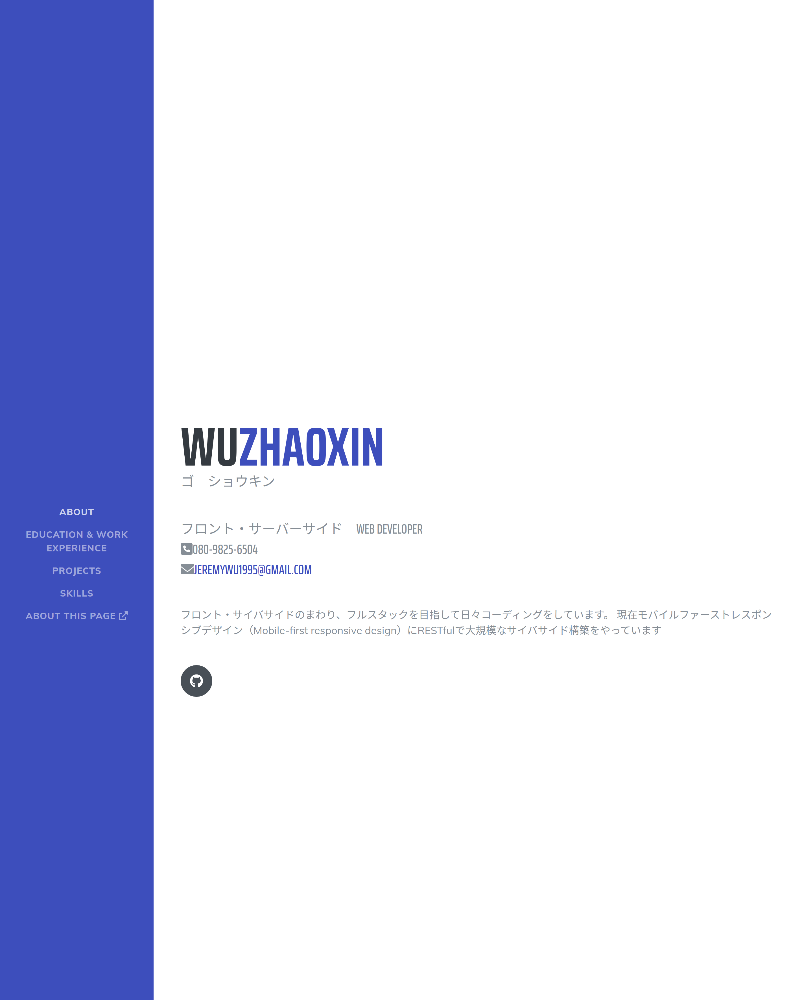

# A complete refactoring of the jQuery-Bootstrap centered resume page
This is a resume page originally composed with good-old jQuery, vanilla JavaScript and bootstrap almost three years ago.
We all know how that went down, so... I rewrote this thing with React, just like everyone likes nowadays.

[Check Page Here](https://yagigo.github.io/)

## Features
A complete rewrite from Bootstrap-jQuery based page to react-based SPA. All animations and elements are 
rewritten with react components.

Note: css parts have not been modularized yet.

## Dependencies
- Fontawesome: icons and fonts
- gh-pages: for hosting the page on github
- react-bootstrap: boostrap components for react.
- react-scroll: animation

## How to run this
you know the drills

`yarn`

`yarn start`

`yarn test`

`yarn build`

TODO: planning on using eslint with prettier for code styling check

## Credit
The style was forked from [here](https://github.com/StartBootstrap/startbootstrap-resume). Thanks for this simple and 
straightforward design :)